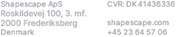

<!-- 
First Page
 -->

  <table>
    <tr>
        <th></th>
        <th></th>
        <th></th>
    </tr>
  </table>

 
 
 
 
<h1 class="large-centered">PRODUCTNAME</h1>
<h2 class="large-centered">Content Guide</h2>
 
 
 

<!-- 
Table of contents page
 -->

<h1 class="title">CONTENTS</h1>

_The items in this section are hyperlinks that allow for easier navigation through the document._

- **[Known Issues](#known-issues)**
  - [Assertion Errors](#assertion-errors)
  - [Technical Issues](#technical-issues)
  - [Intentional Design](#intentional-design)
- **[Design](#design)**
    - [Completion Guide](#completion-guide)
    - [Navigation](#navigation)
        - [General](#general)
        - [Key Locations](#key-locations)
        - [Landmarks](#landmarks)
        - [Containers](#containers)
        - [Hidden Content](#hidden-content)
    - [Gameplay Elements](#gameplay-elements)
        - [Mechanics](#mechanics)
        - [User Interface](#user-interface)
        - [Added Key Bindings](#added-key-bindings)
    - [Characters and Villagers](#characters-and-villagers)
- **[Technical Elements](#technical-elements)**
    - [Changes to Minecraft Functionality](#changes-to-minecraft-functionality)
    - [Custom Creatures, Entities and Decorations](#custom-creatures-entities-and-decorations)
        - [Player Facing Entities](#player-facing-entities)
            - [Living creatures](#living-creatures)
            - [Menus and other interactive entities](#menus-and-other-interactive-entities)
            - [Projectiles](#projectiles)
            - [Vehicles](#vehicles)
            - [Decorations](#decorations)
            - [Block Entities](#block-entities)
            - [Utilities](#utilities)
        - [Non-Player Facing Entities](#non-player-facing-entities)
    - [Custom Inventory Items](#custom-inventory-items)
        - [Player Facing Items](#player-facing-items)
            - [Spawn Eggs](#player-facing-spawn-eggs)
            - [Custom Blocks](#player-facing-custom-blocks)
            - [Regular Items](#player-facing-regular-items)
        - [Non-Player Facing Items](#non-player-facing-items)
            - [Spawn Eggs](#non-player-facing-spawn-eggs)
            - [Custom Blocks](#non-player-facing-custom-blocks)
            - [Regular Items](#non-player-facing-regular-items)
    - [Trades](#trades)
    - [Custom Sounds](#custom-sounds)
    - [Features And Feature Rules](#features-and-feature-rules)
        - [Feature Rules](#feature-rules)
        - [Features](#features)
        - [The Feature Tree](#the-feature-tree)
- **[Changelog](#changelog)**

<!-- 
Known Issues page
 -->

<h1 class="title">KNOWN ISSUES</h1>

_This section lists issues that we have identified ourselves but are unable or unwilling to fix ourselves due to a multitude of reasons._

## Assertion Errors
_Listed below are all the assertion errors that we have identified ourselves. Assertion errors are non-critical warning messages that highlight parts of the Minecraft code that break due to our product. These errors are not a concern for retail users, as they only occur in the development versions of the game. This information is also useful to QA testers to help identify assertions that are not caused by the ingestion process._

:generate: insert("templates/known_issues/assertion_errors.md")

## Technical Issues
_Below is a list of technical issues that we have identified but are unable or unwilling to fix due to a variety of reasons._

:generate: insert("templates/known_issues/technical_issues.md")

## Intentional Design
_Listed below are intentional design decisions that may not be clear enough when testing the product._

:generate: insert("templates/known_issues/intentional_design.md")

<!-- 
Design pages
 -->

<h1 class="title">DESIGN</h1>

_This section contains all the relevant information that the user needs to successfully complete the product._

## World Settings
_This section lists the intended world settings._
:generate: insert("templates/world_settings.md")

## Completion Guide
:generate: completion_guide("completion_guide/*.mcfunction")

## Navigation
### General
:generate: insert("templates/navigation_general.md")

### Key Locations
:generate: warp("warp/key_locations/*.mcfunction")

### Landmarks
:generate: warp("warp/landmarks/*.mcfunction")

### Containers
:generate: insert("templates/containers.md")

### Hidden Content
:generate: insert("templates/hidden_content.md")

## Gameplay Elements
### Mechanics
:generate: insert("templates/mechanics.md")

### User Interface
:generate: insert("templates/ui.md")

### Added Key Bindings
:generate: insert("templates/key_bindings.md")

## Characters and Villagers
### Characters
_Every entity relevant to the story._

:generate: summarize_entities_in_tables("**/*.json", null, ["character"])

### Villagers

_Every entity used for trading._

:generate: summarize_entities_in_tables("**/*.json", null, ["trader"])

<!-- 
Technical Elements pages
 -->

<h1 class="title">TECHNICAL ELEMENTS</h1>

_The purpose of this section is to inform the user about specific game entities, items, or sounds, enhancing their overall understanding of the product._

## Changes to Minecraft Functionality
:generate: insert("templates/mc_functionality_changes.md")

## Custom Creatures, Entities and Decorations

_All Entities_

### Player Facing Entities

_All entities that the player can see/interact with in normal gameplay._

#### Living creatures
_Every living entity that performs some actions on its own._

:generate: summarize_entities_in_tables("**/*.json", null, ["creature"])

#### Menus and other interactive entities
_Shops and menus. non--living entities that player can interact with._

:generate: summarize_entities_in_tables("**/*.json", null, ["interactive_entity"])

#### Projectiles
_Every projectile in the game._

:generate: summarize_entities_in_tables("**/*.json", null, ["projectile"])

#### Vehicles
_Every vehicle in the game._

:generate: summarize_entities_in_tables("**/*.json", null, ["vehicle"])

#### Decorations
_Purely decorative entities._

:generate: summarize_entities_in_tables("**/*.json", null, ["decoration"])

#### Block Entities
_Entities imitating blocks._

:generate: summarize_entities_in_tables("**/*.json", null, ["block_entities"])

#### Utilities
_Entities that are visible but don't interact with the player directly._

:generate: summarize_entities_in_tables("**/*.json", null, ["player_facing_utility"])

### Non-Player Facing Entities
_Invisible entities that affect the game in some way._

:generate: summarize_entities_in_tables("**/*.json", null, ["non-_player_facing_utility"])

## Custom Inventory Items

_All items._
### Player Facing Items

_Items that can be used by players._
#### Player Facing Spawn Eggs
:generate: summarize_spawn_eggs("**/*.json", null, "player_facing")

#### Player Facing Custom Blocks
:generate: summarize_blocks("**/*.json", null, "player_facing")

#### Player Facing Items
:generate: summarize_items("**/*.json", null, "player_facing")

 

### Non-Player Facing Items

_Items that are not intended for players, but have some technical purpose._
#### Non-Player Facing Spawn Eggs
:generate: summarize_spawn_eggs("**/*.json", null, "non_player_facing")

#### Non-Player Facing Custom Blocks
:generate: summarize_blocks("**/*.json", null, "non_player_facing")

#### Non-Player Facing Items
:generate: summarize_items("**/*.json", null, "non_player_facing")

## Trades
_Shows the trade table of entities_

:generate: summarize_trades("**/*.json", null)

## Custom Sounds
_Shows all custom sounds_
:generate: sound_definitions()

## Features And Feature Rules
### Feature Rules
:generate: summarize_feature_rules_in_tables()

### Features
:generate: summarize_features_in_tables()

### The Feature Tree
:generate: feature_tree()

<!-- 
Changelog pages
 -->

<h1 class="title">CHANGELOG</h1>

_This section will contain the changelog in case of updates._
:generate: insert("templates/most_recent_changes.md")
